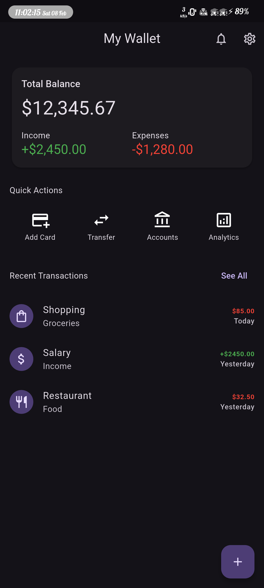
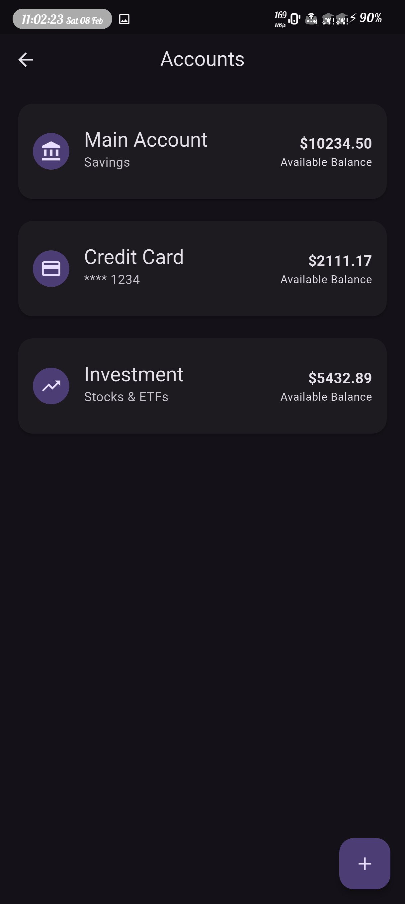
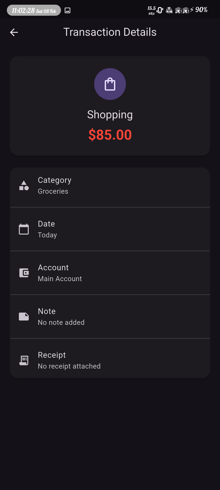
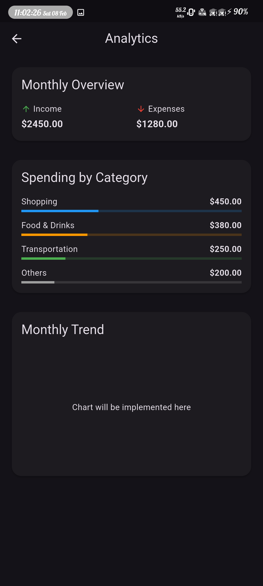
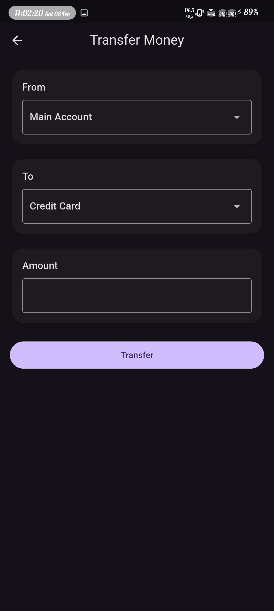
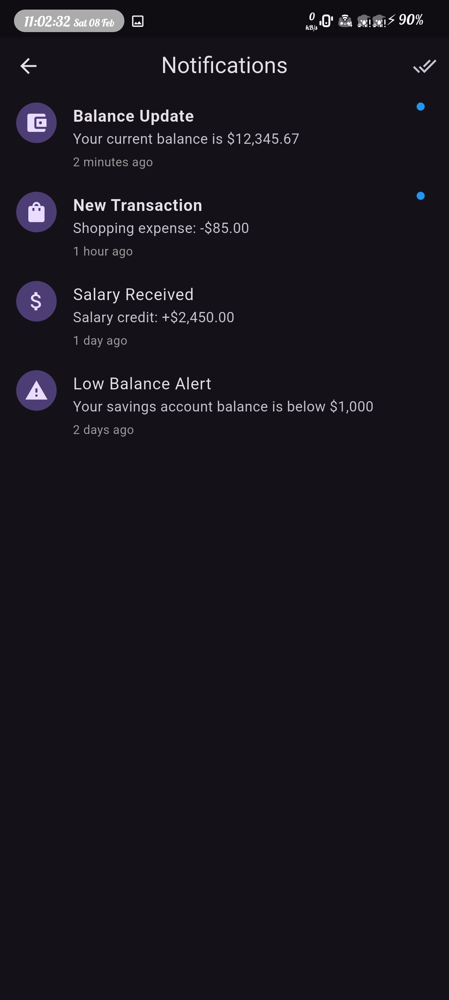
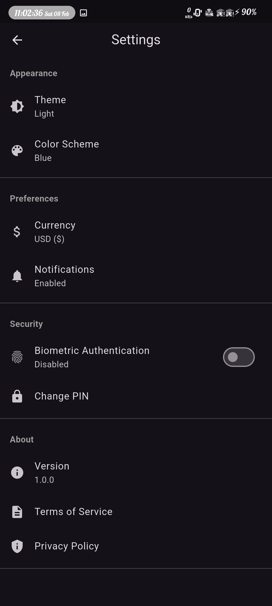

# 💰 Wallet App

A modern and feature-rich Flutter wallet application for managing your finances effectively.

## ✨ Features

- 💳 **Account Management** - Easily manage multiple accounts and track balances
- 📊 **Transaction History** - View and track all your financial transactions
- 💳 **Cards Management** - Manage your credit and debit cards in one place
- 📈 **Analytics** - Get insights into your spending patterns
- 💸 **Transfer Money** - Seamless money transfer between accounts
- 🔔 **Notifications** - Stay updated with transaction alerts
- ⚙️ **Settings** - Customize the app according to your preferences

## 📱 App Preview

### 🏠 Home & Account Overview

 

### 💰 Cards and Account Management

 

### 💳 Transactions, Analytics & Transfer

  

### 🔄 Notifications & Settings

 

